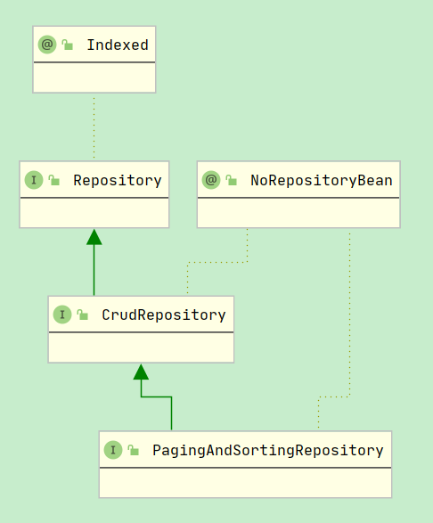

### jpa 是什么

jps全程，Java Persistence Api，jpa是一种规范； 

### 引入oracle jar包依赖

1. 先查看oracle版本。

   ```sql
   select* from v$version;
   ```

2. 去[官网]('https://www.oracle.com/database/technologies/appdev/jdbc-downloads.html')下载对应的依赖包，因为授权原因，maven公共仓库上是没有这个驱动包的。

   > ojdbc 后的数字是支持哪个java版本，ojdbc6 支持 java 6,7,8

3. 安装到本地仓库

   ```
   mvn install:install-file -DgroupId=com.oracle -DartifactId=ojdbc6 -Dversion=12.9.9 -Dpackaging=jar -Dfile=ojdbc6.jar
   ```

4. 再引入依赖

   ```
   <dependency>
       <groupId>com.oracle</groupId>
       <artifactId>ojdbc6</artifactId>
       <version>12.9.9</version>
   </dependency>
   ```

### 引入dozer依赖

dozer是一个工具类，可以方便的在 PO，BO，DO，VO之间对象对象的转换，默认是根据字段名来匹配的。

```xml
<dependency>
    <groupId>net.sf.dozer</groupId>
    <artifactId>dozer</artifactId>
    <version>5.4.0</version>
</dependency>
```

其java配置类如下

```
@Bean
public DozerBeanMapper dozerBeanMapper(){
	return new DozerBeanMapper();
}
```

### spring  jpa 配置多数据源


****

### spring data jpa 

#### 1. Repository



分页的代码：

```java
Page<User> users = repository.findAll(PageRequest.of(1, 20));
```

