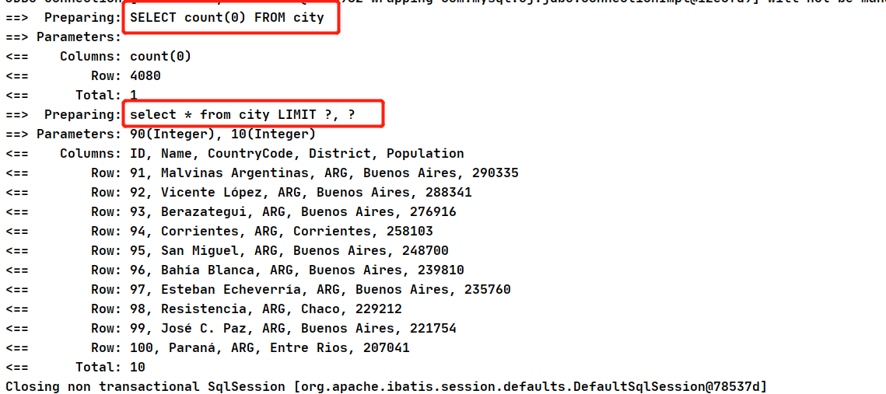

## MyBatis 使用

工作中一直都在零零散散的使用MyBtis与其他持久化框架，但是从来没有系统性的学习过MyBatis的使用，每次都是直接把别人的接口和mapper抄过来改改，直接拿去用了。今天mybatis从0开始，温故而知新，再来一遍MyBatis。


### 一、对象的作用域和生命周期

#### 1、SqlSessionFactoryBuilder

这个类是用来创建SqlSessionFactory的，一旦创建了SqlSessionFactory，就没用了，所以是一次性的，他的作用范围是方法级的。可以重用同一个builder创建多个SqlSessionFactory。

#### 2、SqlSessionFactory

SqlSessionFactory 一旦被创建就应该在应用的运行期间一直存在，没有任何理由丢弃它或重新创建另一个实例。 使用 SqlSessionFactory 的最佳实践是在应用运行期间不要重复创建多次，多次重建 SqlSessionFactory 被视为一种代码“坏习惯”。因此 SqlSessionFactory 的最佳作用域是**应用作用域**。 有很多方法可以做到，最简单的就是使用单例模式或者静态单例模式。

#### 3、SqlSession

**每个线程都应该有它自己的 SqlSession 实例。**SqlSession 的实例不是线程安全的，因此是不能被共享的，所以它的最佳的作用域是请求或方法作用域。 绝对不能将 SqlSession 实例的引用放在一个类的静态域，甚至一个类的实例变量也不行。 也绝不能将 SqlSession 实例的引用放在任何类型的托管作用域中，比如 Servlet 框架中的 HttpSession。 如果你现在正在使用一种 Web 框架，考虑将 SqlSession 放在一个和 HTTP 请求相似的作用域中。 换句话说，每次收到 HTTP 请求，就可以打开一个 SqlSession，返回一个响应后，就关闭它。 这个关闭操作很重要，为了确保每次都能执行关闭操作，你应该把这个关闭操作放到 finally 块中。

#### 4、映射器实例（Mapper实例）

映射器是一些绑定映射语句的接口。映射器接口的实例是从 SqlSession 中获得的。虽然从技术层面上来讲，任何映射器实例的最大作用域与请求它们的 SqlSession 相同。但方法作用域才是映射器实例的最合适的作用域。 也就是说，映射器实例应该在调用它们的方法中被获取，使用完毕之后即可丢弃。 映射器实例并不需要被显式地关闭。尽管在整个请求作用域保留映射器实例不会有什么问题，但是你很快会发现，在这个作用域上管理太多像 SqlSession 的资源会让你忙不过来。 因此，最好将映射器放在方法作用域内。


### 二、XML映射

#### 1、select

select 元素允许你配置很多属性来配置每条语句的行为细节。

```
<select
  id="selectPerson"
  parameterType="int"
  parameterMap="deprecated"
  resultType="hashmap"
  resultMap="personResultMap"
  flushCache="false"
  useCache="true"
  timeout="10"
  fetchSize="256"
  statementType="PREPARED"
  resultSetType="FORWARD_ONLY">
```


| 属性             | 描述                                                         |
| :--------------- | :----------------------------------------------------------- |
| `id`             | 在命名空间中唯一的标识符，可以被用来引用这条语句。           |
| `parameterType`  | 将会传入这条语句的参数的类全限定名或别名。这个属性是可选的，因为 MyBatis 可以通过类型处理器（TypeHandler）推断出具体传入语句的参数，默认值为未设置（unset）。 |
| ~~parameterMap~~ | 用于引用外部 parameterMap 的属性，目前已被废弃。请使用行内参数映射和 parameterType 属性。 |
| `resultType`     | 期望从这条语句中返回结果的类全限定名或别名。 注意，如果返回的是集合，那应该设置为集合包含的类型，而不是集合本身的类型。 **resultType 和 resultMap 之间只能同时使用一个。** |
| `resultMap`      | 对外部 resultMap 的命名引用。结果映射是 MyBatis 最强大的特性，如果你对其理解透彻，许多复杂的映射问题都能迎刃而解。 **resultType 和 resultMap 之间只能同时使用一个。** |
| `flushCache`     | 将其设置为 true 后，只要语句被调用，都会导致本地缓存和二级缓存被清空，默认值：false。 |
| `useCache`       | 将其设置为 true 后，将会导致本条语句的结果被二级缓存缓存起来，默认值：对 select 元素为 true。 |
| `timeout`        | 这个设置是在抛出异常之前，驱动程序等待数据库返回请求结果的秒数。默认值为未设置（unset）（依赖数据库驱动）。 |
| `fetchSize`      | 这是一个给驱动的建议值，尝试让驱动程序每次批量返回的结果行数等于这个设置值。 默认值为未设置（unset）（依赖驱动）。 |
| `statementType`  | 可选 STATEMENT，PREPARED 或 CALLABLE。这会让 MyBatis 分别使用 Statement，PreparedStatement 或 CallableStatement，默认值：PREPARED。 |
| `resultSetType`  | FORWARD_ONLY，SCROLL_SENSITIVE, SCROLL_INSENSITIVE 或 DEFAULT（等价于 unset） 中的一个，默认值为 unset （依赖数据库驱动）。 |
| `databaseId`     | 如果配置了数据库厂商标识（databaseIdProvider），MyBatis 会加载所有不带 databaseId 或匹配当前 databaseId 的语句；如果带和不带的语句都有，则不带的会被忽略。 |
| `resultOrdered`  | 这个设置仅针对嵌套结果 select 语句：如果为 true，将会假设包含了嵌套结果集或是分组，当返回一个主结果行时，就不会产生对前面结果集的引用。 这就使得在获取嵌套结果集的时候不至于内存不够用。默认值：`false`。 |
| `resultSets`     | 这个设置仅适用于多结果集的情况。它将列出语句执行后返回的结果集并赋予每个结果集一个名称，多个名称之间以逗号分隔。 |

#### 2、insert update delete

数据变更语句 insert，update 和 delete 的实现非常接近：

```
<insert
  id="insertAuthor"
  parameterType="domain.blog.Author"
  flushCache="true"
  statementType="PREPARED"
  keyProperty=""
  keyColumn=""
  useGeneratedKeys=""
  timeout="20">

<update
  id="updateAuthor"
  parameterType="domain.blog.Author"
  flushCache="true"
  statementType="PREPARED"
  timeout="20">

<delete
  id="deleteAuthor"
  parameterType="domain.blog.Author"
  flushCache="true"
  statementType="PREPARED"
  timeout="20">
```


| 属性               | 描述                                                         |
| :----------------- | :----------------------------------------------------------- |
| `id`               | 在命名空间中唯一的标识符，可以被用来引用这条语句。           |
| `parameterType`    | 将会传入这条语句的参数的类全限定名或别名。这个属性是可选的，因为 MyBatis 可以通过类型处理器（TypeHandler）推断出具体传入语句的参数，默认值为未设置（unset）。 |
| `parameterMap`     | 用于引用外部 parameterMap 的属性，目前已被废弃。请使用行内参数映射和 parameterType 属性。 |
| `flushCache`       | 将其设置为 true 后，只要语句被调用，都会导致本地缓存和二级缓存被清空，默认值：（对 insert、update 和 delete 语句）true。 |
| `timeout`          | 这个设置是在抛出异常之前，驱动程序等待数据库返回请求结果的秒数。默认值为未设置（unset）（依赖数据库驱动）。 |
| `statementType`    | 可选 STATEMENT，PREPARED 或 CALLABLE。这会让 MyBatis 分别使用 Statement，PreparedStatement 或 CallableStatement，默认值：PREPARED。 |
| `useGeneratedKeys` | （仅适用于 insert 和 update）这会令 MyBatis 使用 JDBC 的 getGeneratedKeys 方法来取出由数据库内部生成的主键（比如：像 MySQL 和 SQL Server 这样的关系型数据库管理系统的自动递增字段），默认值：false。 |
| `keyProperty`      | （仅适用于 insert 和 update）指定能够唯一识别对象的属性，MyBatis 会使用 getGeneratedKeys 的返回值或 insert 语句的 selectKey 子元素设置它的值，默认值：未设置（`unset`）。如果生成列不止一个，可以用逗号分隔多个属性名称。 |
| `keyColumn`        | （仅适用于 insert 和 update）设置生成键值在表中的列名，在某些数据库（像 PostgreSQL）中，当主键列不是表中的第一列的时候，是必须设置的。如果生成列不止一个，可以用逗号分隔多个属性名称。 |
| `databaseId`       | 如果配置了数据库厂商标识（databaseIdProvider），MyBatis 会加载所有不带 databaseId 或匹配当前 databaseId 的语句；如果带和不带的语句都有，则不带的会被忽略。 |


##### a.插入时使用自增主键

如果数据库支持自增主键 如 MySQL SqlServer，那么你可以设置 useGeneratedKeys=”true”，然后再把 keyProperty 设置为目标属性就 OK 了。

eg：

```xml
<insert id="insertAuthor" useGeneratedKeys="true"
    keyProperty="id">
  insert into Author (username,password,email,bio)
  values (#{username},#{password},#{email},#{bio})
</insert>
```

如果你的数据库还支持**多行插入**, 你也可以传入一个 Author 数组或集合，**并返回自动生成的主键。**

```xml
<insert id="insertAuthor" useGeneratedKeys="true"
    keyProperty="id">
  insert into Author (username, password, email, bio) values
  <foreach item="item" collection="list" separator=",">
    (#{item.username}, #{item.password}, #{item.email}, #{item.bio})
  </foreach>
</insert>
```


也可以通过selectKey的方式，在sql执行前，先通过自定义规则生成一个key，eg：

```xml
<insert id="insertAuthor">
  <selectKey keyProperty="id" resultType="int" order="BEFORE">
    select CAST(RANDOM()*1000000 as INTEGER) a from SYSIBM.SYSDUMMY1
  </selectKey>
  insert into Author
    (id, username, password, email,bio, favourite_section)
  values
    (#{id}, #{username}, #{password}, #{email}, #{bio}, #{favouriteSection,jdbcType=VARCHAR})
</insert>
```

在上面的示例中，首先会运行 selectKey 元素中的语句，并设置 Author 的 id，然后才会调用插入语句。这样就实现了数据库自动生成主键类似的行为，同时保持了 Java 代码的简洁。

##### b.selectKey 元素

描述如下：

```xml
<selectKey
  keyProperty="id"
  resultType="int"
  order="BEFORE"
  statementType="PREPARED">
```

| 属性            | 描述                                                         |
| :-------------- | :----------------------------------------------------------- |
| `keyProperty`   | `selectKey` 语句结果应该被设置到的目标属性。如果生成列不止一个，可以用逗号分隔多个属性名称。 |
| `keyColumn`     | 返回结果集中生成列属性的列名。如果生成列不止一个，可以用逗号分隔多个属性名称。 |
| `resultType`    | 结果的类型。通常 MyBatis 可以推断出来，但是为了更加准确，写上也不会有什么问题。MyBatis 允许将任何简单类型用作主键的类型，包括字符串。如果生成列不止一个，则可以使用包含期望属性的 Object 或 Map。 |
| `order`         | 可以设置为 `BEFORE` 或 `AFTER`。如果设置为 `BEFORE`，那么它首先会生成主键，设置 `keyProperty` 再执行插入语句。如果设置为 `AFTER`，那么先执行插入语句，然后是 `selectKey` 中的语句 - 这和 Oracle 数据库的行为相似，在插入语句内部可能有嵌入索引调用。 |
| `statementType` | 和前面一样，MyBatis 支持 `STATEMENT`，`PREPARED` 和 `CALLABLE` 类型的映射语句，分别代表 `Statement`, `PreparedStatement` 和 `CallableStatement` 类型。 |


#### 3.sql

这个元素可以用来**定义可重用的 SQL 代码片段**，以便在其它语句中使用。 参数可以静态地（在加载的时候）确定下来，并且可以在不同的 include 元素中定义不同的参数值。比如：

```xml
<sql id="userColumns"> ${alias}.id,${alias}.username,${alias}.password </sql>
```

这个 SQL 片段可以在其它语句中使用，例如：

```xml
<select id="selectUsers" resultType="map">
  select
    <include refid="userColumns"><property name="alias" value="t1"/></include>,
    <include refid="userColumns"><property name="alias" value="t2"/></include>
  from some_table t1
    cross join some_table t2
</select>
```

也可以在 include 元素的 refid 属性或内部语句中使用属性值，例如：

```xml
<sql id="sometable">
  ${prefix}Table
</sql>

<sql id="someinclude">
  from
    <include refid="${include_target}"/>
</sql>

<select id="select" resultType="map">
  select
    field1, field2, field3
  <include refid="someinclude">
    <property name="prefix" value="Some"/>
    <property name="include_target" value="sometable"/>
  </include>
</select>
```


#### 4.字符串替换

默认情况下，使用 `#{}` 参数语法时，MyBatis 会创建 `PreparedStatement` 参数占位符，并通过占位符安全地设置参数（就像使用 ? 一样）。 这样做更安全，更迅速，通常也是首选做法，不过有时你就是想直接在 SQL 语句中直接插入一个不转义的字符串。 比如 ORDER BY 子句，这时候你可以：

```xml
ORDER BY ${columnName}
```

这样，MyBatis 就不会修改或转义该字符串了。

当 SQL 语句中的元数据（如表名或列名）是动态生成的时候，字符串替换将会非常有用。 举个例子，如果你想 `select` 一个表任意一列的数据时，不需要这样写：

```java
@Select("select * from user where id = #{id}")
User findById(@Param("id") long id);

@Select("select * from user where name = #{name}")
User findByName(@Param("name") String name);

@Select("select * from user where email = #{email}")
User findByEmail(@Param("email") String email);

// 其它的 "findByXxx" 方法
```

而是可以只写这样一个方法：

```java
@Select("select * from user where ${column} = #{value}")
User findByColumn(@Param("column") String column, @Param("value") String value);
```

其中 `${column}` 会被直接替换，而 `#{value}` 会使用 `?` 预处理。 这样，就能完成同样的任务：

```java
User userOfId1 = userMapper.findByColumn("id", 1L);
User userOfNameKid = userMapper.findByColumn("name", "kid");
User userOfEmail = userMapper.findByColumn("email", "noone@nowhere.com");
```

这种方式也同样适用于替换表名的情况。

**提示** 用这种方式接受用户的输入，并用作语句参数是不安全的，会导致潜在的 SQL 注入攻击。因此，要么不允许用户输入这些字段，要么自行转义并检验这些参数。


#### 5.结果映射（Result Map）

用来为ResultSet的字段与Java对象建立映射关系的。

`resultMap` 元素是 MyBatis 中最重要最强大的元素。它可以让你从 90% 的 JDBC `ResultSets` 数据提取代码中解放出来，并在一些情形下允许你进行一些 JDBC 不支持的操作。实际上，在为一些比如连接的复杂语句编写映射代码的时候，一份 `resultMap` 能够代替实现同等功能的数千行代码。ResultMap 的设计思想是，对简单的语句做到零配置，对于复杂一点的语句，只需要描述语句之间的关系就行了。

之前你已经见过简单映射语句的示例，它们没有显式指定 `resultMap`。比如：

```
<select id="selectUsers" resultType="map">
  select id, username, hashedPassword
  from some_table
  where id = #{id}
</select>
```

上述语句只是简单地将所有的列映射到 `HashMap` 的键上，这由 `resultType` 属性指定。虽然在大部分情况下都够用，但是 HashMap 并不是一个很好的领域模型。你的程序更可能会使用 JavaBean 或 POJO（Plain Old Java Objects，普通老式 Java 对象）作为领域模型。MyBatis 对两者都提供了支持。看看下面这个 JavaBean：

```
package com.someapp.model;
public class User {
  private int id;
  private String username;
  private String hashedPassword;

  public int getId() {
    return id;
  }
  public void setId(int id) {
    this.id = id;
  }
  public String getUsername() {
    return username;
  }
  public void setUsername(String username) {
    this.username = username;
  }
  public String getHashedPassword() {
    return hashedPassword;
  }
  public void setHashedPassword(String hashedPassword) {
    this.hashedPassword = hashedPassword;
  }
}
```

基于 JavaBean 的规范，上面这个类有 3 个属性：id，username 和 hashedPassword。这些属性会对应到 select 语句中的列名。

这样的一个 JavaBean 可以被映射到 `ResultSet`，就像映射到 `HashMap` 一样简单。

```
<select id="selectUsers" resultType="com.someapp.model.User">
  select id, username, hashedPassword
  from some_table
  where id = #{id}
</select>
```

类型别名是你的好帮手。使用它们，你就可以不用输入类的全限定名了。比如：

```
<!-- mybatis-config.xml 中 -->
<typeAlias type="com.someapp.model.User" alias="User"/>

<!-- SQL 映射 XML 中 -->
<select id="selectUsers" resultType="User">
  select id, username, hashedPassword
  from some_table
  where id = #{id}
</select>
```

在这些情况下，MyBatis 会在幕后自动创建一个 `ResultMap`，再根据属性名来映射列到 JavaBean 的属性上。如果列名和属性名不能匹配上，可以在 SELECT 语句中设置列别名（这是一个基本的 SQL 特性）来完成匹配。比如：

```
<select id="selectUsers" resultType="User">
  select
    user_id             as "id",
    user_name           as "userName",
    hashed_password     as "hashedPassword"
  from some_table
  where id = #{id}
</select>
```

在学习了上面的知识后，你会发现上面的例子没有一个需要显式配置 `ResultMap`，这就是 `ResultMap` 的优秀之处——你完全可以不用显式地配置它们。 虽然上面的例子不用显式配置 `ResultMap`。 但为了讲解，我们来看看如果在刚刚的示例中，显式使用外部的 `resultMap` 会怎样，这也是解决列名不匹配的另外一种方式。

```
<resultMap id="userResultMap" type="User">
  <id property="id" column="user_id" />
  <result property="username" column="user_name"/>
  <result property="password" column="hashed_password"/>
</resultMap>
```

然后在引用它的语句中设置 `resultMap` 属性就行了（注意我们去掉了 `resultType` 属性）。比如:

```
<select id="selectUsers" resultMap="userResultMap">
  select user_id, user_name, hashed_password
  from some_table
  where id = #{id}
</select>
```

如果这个世界总是这么简单就好了。


#### 6.高级结果映射

//todo


### 三、如何自动映射的？

当自动映射查询结果时，MyBatis 会获取结果中返回的列名并在 Java 类中查找相同名字的属性（**忽略大小写**）。 这意味着如果发现了 ID 列和 id 属性，MyBatis 会将列 ID 的值赋给 id 属性。

通常数据库列使用大写字母组成的单词命名，单词间用下划线分隔；而 Java 属性一般遵循驼峰命名法约定。为了在这两种命名方式之间启用自动映射，需要将 **mapUnderscoreToCamelCase** 设置为 true。

//todo 

### 四、缓存


// todo 

### 五、动态Sql

#### if

使用动态 SQL 最常见情景是根据条件包含 where 子句的一部分。比如：

```xml
<select id="findActiveBlogWithTitleLike"
     resultType="Blog">
  SELECT * FROM BLOG
  WHERE state = ‘ACTIVE’
  <if test="title != null">
    AND title like #{title}
  </if>
</select>
```

这条语句提供了可选的查找文本功能。如果不传入 “title”，那么所有处于 “ACTIVE” 状态的 BLOG 都会返回；如果传入了 “title” 参数，那么就会对 “title” 一列进行模糊查找并返回对应的 BLOG 结果（细心的读者可能会发现，“title” 的参数值需要包含查找掩码或通配符字符）。

如果希望通过 “title” 和 “author” 两个参数进行可选搜索该怎么办呢？首先，我想先将语句名称修改成更名副其实的名称；接下来，只需要加入另一个条件即可。

```xml
<select id="findActiveBlogLike"
     resultType="Blog">
  SELECT * FROM BLOG WHERE state = ‘ACTIVE’
  <if test="title != null">
    AND title like #{title}
  </if>
  <if test="author != null and author.name != null">
    AND author_name like #{author.name}
  </if>
</select>
```

#### choose、when、otherwise

类似于Java中的switch  when   否则

还是上面的例子，但是策略变为：传入了 “title” 就按 “title” 查找，传入了 “author” 就按 “author” 查找的情形。若两者都没有传入，就返回标记为 featured 的 BLOG（这可能是管理员认为，与其返回大量的无意义随机 Blog，还不如返回一些由管理员挑选的 Blog）。

<select id="findActiveBlogLike"
     resultType="Blog">
  SELECT * FROM BLOG WHERE state = ‘ACTIVE’
  <choose>
    <when test="title != null">
      AND title like #{title}
    </when>
    <when test="author != null and author.name != null">
      AND author_name like #{author.name}
    </when>
    <otherwise>
      AND featured = 1
    </otherwise>
  </choose>
</select>

#### where

前面几个例子已经合宜地解决了一个臭名昭著的动态 SQL 问题。现在回到之前的 “if” 示例，这次我们将 “state = ‘ACTIVE’” 设置成动态条件，看看会发生什么。

```xml
<select id="findActiveBlogLike"
     resultType="Blog">
  SELECT * FROM BLOG
  WHERE
  <if test="state != null">
    state = #{state}
  </if>
  <if test="title != null">
    AND title like #{title}
  </if>
  <if test="author != null and author.name != null">
    AND author_name like #{author.name}
  </if>
</select>
```

如果没有匹配的条件会怎么样？最终这条 SQL 会变成这样：

```xml
SELECT * FROM BLOG
WHERE
```

这会导致查询失败。如果匹配的只是第二个条件又会怎样？这条 SQL 会是这样:

```xml
SELECT * FROM BLOG
WHERE
AND title like ‘someTitle’
```

这个查询也会失败。这个问题不能简单地用条件元素来解决。这个问题是如此的难以解决，以至于解决过的人不会再想碰到这种问题。

MyBatis 有一个简单且适合大多数场景的解决办法。而在其他场景中，可以对其进行自定义以符合需求。而这，只需要一处简单的改动：

```xml
<select id="findActiveBlogLike"
     resultType="Blog">
  SELECT * FROM BLOG
  <where>
    <if test="state != null">
         state = #{state}
    </if>
    <if test="title != null">
        AND title like #{title}
    </if>
    <if test="author != null and author.name != null">
        AND author_name like #{author.name}
    </if>
  </where>
</select>
```

*where* 元素只会在子元素返回任何内容的情况下才插入 “WHERE” 子句。而且，若子句的开头为 “AND” 或 “OR”，*where* 元素也会将它们去除。


#### set

set元素是用来更新的，配合update语句使用，*set* 元素可以用于动态包含需要更新的列，忽略其它不更新的列。比如：

```xml
<update id="updateAuthorIfNecessary">
  update Author
    <set>
      <if test="username != null">username=#{username},</if>
      <if test="password != null">password=#{password},</if>
      <if test="email != null">email=#{email},</if>
      <if test="bio != null">bio=#{bio}</if>
    </set>
  where id=#{id}
</update>
```

这个例子中，*set* 元素会动态地在行首插入 SET 关键字，并会删掉额外的逗号（这些逗号是在使用条件语句给列赋值时引入的）。


#### foreach

动态 SQL 的另一个常见使用场景是对集合进行遍历（尤其是在构建 IN 条件语句的时候）。比如：

```xml
<select id="selectPostIn" resultType="domain.blog.Post">
  SELECT *
  FROM POST P
  WHERE ID in
  <foreach item="item" index="index" collection="list"
      open="(" separator="," close=")">
        #{item}
  </foreach>
</select>
```

*foreach* 元素的功能非常强大，它允许你指定一个集合，声明可以在元素体内使用的集合项（item）和索引（index）变量。它也允许你指定开头与结尾的字符串以及集合项迭代之间的分隔符。这个元素也不会错误地添加多余的分隔符，看它多智能！

**提示** 你可以将任何可迭代对象（如 List、Set 等）、Map 对象或者数组对象作为集合参数传递给 *foreach*。当使用可迭代对象或者数组时，index 是当前迭代的序号，item 的值是本次迭代获取到的元素。当使用 Map 对象（或者 Map.Entry 对象的集合）时，index 是键，item 是值。


#### script标签 

通过script标签，可以在Java 的Mapper文件中写xml，进而实现sql的动态拼接

```java
   @Update({"<script>",
      "update Author",
      "  <set>",
      "    <if test='username != null'>username=#{username},</if>",
      "    <if test='password != null'>password=#{password},</if>",
      "    <if test='email != null'>email=#{email},</if>",
      "    <if test='bio != null'>bio=#{bio}</if>",
      "  </set>",
      "where id=#{id}",
      "</script>"})
    void updateAuthorValues(Author author);
```


### 六、Java API


#### 1.SqlSessionFactory

SqlSessionFactory 有六个方法创建 SqlSession 实例。通常来说，当你选择其中一个方法时，你需要考虑以下几点：

- **事务处理**：你希望在 session 作用域中使用事务作用域，还是使用自动提交（auto-commit）？（对很多数据库和/或 JDBC 驱动来说，等同于关闭事务支持）
- **数据库连接**：你希望 MyBatis 帮你从已配置的数据源获取连接，还是使用自己提供的连接？
- **语句执行**：你希望 MyBatis 复用 PreparedStatement 和/或批量更新语句（包括插入语句和删除语句）吗？

基于以上需求，有下列已重载的多个 openSession() 方法供使用。

```java
SqlSession openSession()
SqlSession openSession(boolean autoCommit)
SqlSession openSession(Connection connection)
SqlSession openSession(TransactionIsolationLevel level)
SqlSession openSession(ExecutorType execType, TransactionIsolationLevel level)
SqlSession openSession(ExecutorType execType)
SqlSession openSession(ExecutorType execType, boolean autoCommit)
SqlSession openSession(ExecutorType execType, Connection connection)
Configuration getConfiguration();
```

默认的 openSession() 方法没有参数，它会创建具备如下特性的 SqlSession：

- 事务作用域将会开启（也就是不自动提交）。
- 将由当前环境配置的 DataSource 实例中获取 Connection 对象。
- 事务隔离级别将会使用驱动或数据源的默认设置。
- 预处理语句不会被复用，也不会批量处理更新。


#### 2.SqlSession

它包含了所有执行语句、提交或回滚事务以及获取映射器实例的方法。

SqlSession 类的方法超过了 20 个， 

```java
public interface SqlSession extends Closeable {
    <T> T selectOne(String var1);

    <T> T selectOne(String var1, Object var2);

    <E> List<E> selectList(String var1);

    <E> List<E> selectList(String var1, Object var2);

    <E> List<E> selectList(String var1, Object var2, RowBounds var3);

    <K, V> Map<K, V> selectMap(String var1, String var2);

    <K, V> Map<K, V> selectMap(String var1, Object var2, String var3);

    <K, V> Map<K, V> selectMap(String var1, Object var2, String var3, RowBounds var4);

    <T> Cursor<T> selectCursor(String var1);

    <T> Cursor<T> selectCursor(String var1, Object var2);

    <T> Cursor<T> selectCursor(String var1, Object var2, RowBounds var3);

    void select(String var1, Object var2, ResultHandler var3);

    void select(String var1, ResultHandler var2);

    void select(String var1, Object var2, RowBounds var3, ResultHandler var4);

    int insert(String var1);

    int insert(String var1, Object var2);

    int update(String var1);

    int update(String var1, Object var2);

    int delete(String var1);

    int delete(String var1, Object var2);

    void commit();

    void commit(boolean var1);

    void rollback();

    void rollback(boolean var1);

    List<BatchResult> flushStatements();

    void close();

    void clearCache();

    Configuration getConfiguration();

    <T> T getMapper(Class<T> var1);

    Connection getConnection();
}
```

##### 事务控制

有四个方法用来控制事务作用域。当然，如果你已经设置了自动提交或你使用了外部事务管理器，这些方法就没什么作用了。然而，如果你正在使用由 Connection 实例控制的 JDBC 事务管理器，那么这四个方法就会派上用场：

```
void commit()
void commit(boolean force)
void rollback()
void rollback(boolean force)
```

##### 本地缓存

Mybatis 使用到了两种缓存：本地缓存（local cache）和二级缓存（second level cache）。

每当一个新 session 被创建，MyBatis 就会创建一个与之相关联的本地缓存。任何在 session 执行过的查询结果都会被保存在本地缓存中，所以，当再次执行参数相同的相同查询时，就不需要实际查询数据库了。本地缓存将会在做出修改、事务提交或回滚，以及关闭 session 时清空。


#### 3.注解

映射注解示例：

这个例子展示了如何使用 @SelectKey 注解来在插入前读取数据库序列的值：

```
@Insert("insert into table3 (id, name) values(#{nameId}, #{name})")
@SelectKey(statement="call next value for TestSequence", keyProperty="nameId", before=true, resultType=int.class)
int insertTable3(Name name);
```

这个例子展示了如何使用 @SelectKey 注解来在插入后读取数据库自增列的值：

```
@Insert("insert into table2 (name) values(#{name})")
@SelectKey(statement="call identity()", keyProperty="nameId", before=false, resultType=int.class)
int insertTable2(Name name);
```

这个例子展示了如何使用 `@Flush` 注解来调用 `SqlSession#flushStatements()`：

```
@Flush
List<BatchResult> flush();
```

这些例子展示了如何通过指定 @Result 的 id 属性来命名结果集：

```
@Results(id = "userResult", value = {
  @Result(property = "id", column = "uid", id = true),
  @Result(property = "firstName", column = "first_name"),
  @Result(property = "lastName", column = "last_name")
})
@Select("select * from users where id = #{id}")
User getUserById(Integer id);

@Results(id = "companyResults")
@ConstructorArgs({
  @Arg(column = "cid", javaType = Integer.class, id = true),
  @Arg(column = "name", javaType = String.class)
})
@Select("select * from company where id = #{id}")
Company getCompanyById(Integer id);
```

这个例子展示了如何使用单个参数的 @SqlProvider 注解：

```
@SelectProvider(type = UserSqlBuilder.class, method = "buildGetUsersByName")
List<User> getUsersByName(String name);

class UserSqlBuilder {
  public static String buildGetUsersByName(final String name) {
    return new SQL(){{
      SELECT("*");
      FROM("users");
      if (name != null) {
        WHERE("name like #{value} || '%'");
      }
      ORDER_BY("id");
    }}.toString();
  }
}
```

这个例子展示了如何使用多个参数的 @SqlProvider 注解：

```
@SelectProvider(type = UserSqlBuilder.class, method = "buildGetUsersByName")
List<User> getUsersByName(
    @Param("name") String name, @Param("orderByColumn") String orderByColumn);

class UserSqlBuilder {

  // 如果不使用 @Param，就应该定义与 mapper 方法相同的参数
  public static String buildGetUsersByName(
      final String name, final String orderByColumn) {
    return new SQL(){{
      SELECT("*");
      FROM("users");
      WHERE("name like #{name} || '%'");
      ORDER_BY(orderByColumn);
    }}.toString();
  }

  // 如果使用 @Param，就可以只定义需要使用的参数
  public static String buildGetUsersByName(@Param("orderByColumn") final String orderByColumn) {
    return new SQL(){{
      SELECT("*");
      FROM("users");
      WHERE("name like #{name} || '%'");
      ORDER_BY(orderByColumn);
    }}.toString();
  }
}
```

以下例子展示了 `ProviderMethodResolver`（3.5.1 后可用）的默认实现使用方法：

```
@SelectProvider(UserSqlProvider.class)
List<User> getUsersByName(String name);

// 在你的 provider 类中实现 ProviderMethodResolver 接口
class UserSqlProvider implements ProviderMethodResolver {
  // 默认实现中，会将映射器方法的调用解析到实现的同名方法上
  public static String getUsersByName(final String name) {
    return new SQL(){{
      SELECT("*");
      FROM("users");
      if (name != null) {
        WHERE("name like #{value} || '%'");
      }
      ORDER_BY("id");
    }}.toString();
  }
}
```

This example shows usage the `databaseId` attribute on the statement annotation(Available since 3.5.5):

```
@Select(value = "SELECT SYS_GUID() FROM dual", databaseId = "oracle") // Use this statement if DatabaseIdProvider provide "oracle"
@Select(value = "SELECT uuid_generate_v4()", databaseId = "postgres") // Use this statement if DatabaseIdProvider provide "postgres"
@Select("SELECT RANDOM_UUID()") // Use this statement if the DatabaseIdProvider not configured or not matches databaseId
String generateId();
```


### 七、拓展

#### 1、集成分页插件

先引入依赖

```xml
<dependency>
    <groupId>com.github.pagehelper</groupId>
    <artifactId>pagehelper-spring-boot-starter</artifactId>
    <version>1.2.5</version>
</dependency>
```


简单使用方式：

```java
	@Test
    //测试使用 mybatis page helper 实现分页查询
    public void testQueryByPage(){
        PageHelper.startPage(10, 10);
        List<City> result = cityMapper.queryCityByPage();
        PageInfo<City> ss = new PageInfo<>(result);

    }
```

>  需要注意的是：只有紧跟在PageHelper.startPage方法后的第一个Mybatis的查询（Select）方法会被分页。

注意上面这段代码，一开始我以为这个分页是数据分页，并非物理分页，但实际上作者是做了物理分页的，通过在mybatis的sqlsesisonFactory中开启日志输出至控制台：

```
configuration.setLogImpl(org.apache.ibatis.logging.stdout.StdOutImpl.class);
```

我们可以看到，作者是对sql进行加强了的，先做了一次count，然后通过limit进行了分页。



猜测用户是通过线程变量 + mybatis 拦截器来实现的，回头再细细研究。


#### 2、与spring事务管理器结合

