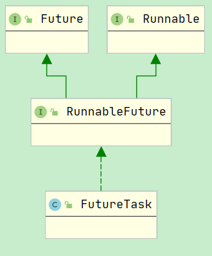

#### 主要是以下几个测试目的
1 测试线程池的用法，包括：
   * ThreadPoolExecutor的用法
   * jdk7新引入的ForkJoinPool的用法
   
2 测试异步与回调，弄清楚以下几个问题：
   * Runnable Callable Future RunableFuture  FutureTask的 区别与联系

#### 结论
1. 常用的线程池有哪几种？  

jdk的线程池工具类Executors为我们提供了以下几种常用的线程池：  
* 基于ThreadPoolExecutor实现类
   * singleThreadPool 单线程线程池
   * fixedThreadPool 线程数量固定的线程池，corePoolSize与maximumPoolSize相等。
   * cachedThreadPool 缓存线程池，corePoolSize=0；maximumPoolSize需要执行；默认缓存时间为60s，60s没活干就消亡了；workQueue不能存放任务。
* 基于ScheduledThreadPoolExecutor
   * scheduledThreadPool 可定时调度的线程池
* 基于ForkJoinPool
   * workStealingThreadPool 支持指定并行度的线程池，内部使用了多个任务队列；可指定并发度。

2. ThreadPoolExecutor是如何运作的？  

先贴出其构造方法中的最重要的参数：  
* corePoolSize  核心线程数 核心线程是永存的，即便是没有任何在执行的任务；在线程池执行execute()方法时创建，并运行。
* maximumPoolSize 最大线程数 当核心线程满了，且队列也满了，再有新的任务进来，就会创建新的线程，当线程总数达到最大线程数后，会执行拒绝策略。
* keepAliveTime 线程存货时长
* unit  时间单元
* workQueue 任务队列，当前线程池的在执行任务的线程数量达到核心线程数后，后续的任务会提交到任务队列中。一般来讲，有以下几个选项供选择：
   * LinkedBlockingQueue 基于链表实现的队列，也可以自定义大小，最大值是int的最大值。
   * ArrayBlockingQueue  基于数组实现的队列，必须自定义队列长度，对打值是int的最大值。
   * 注：这两者都是阻塞队列，且这个参数必须是阻塞队列
* threadFactory 线程工厂，默认是使用的DefaultThreadFactory
* handler 拒绝策略  

当通过构造方法new 出来一个新的ThreadPoolExecutor时，线程池此时还处于未启动的状态，只是配置好了相关参数。    

ExecutorService中的 submit() 的各个重载方法底层都是通过其execute()方法实现的（通过FutureTask封装了Runable）。  

当通过线程池的 execute() 方法提交一个Runnable对象时，线程池会根据线程池的类型、配置参数进行判断，创建新线程或将任务加入到阻塞的任务队列中。  

3. 为什么Thread这个类只能执行一次，但线程池中的线程却一直在执行不同的任务？  

看了下ThreadPoolExecutor的原码，他是这样做的，线程池中维护的是一个Worker Set。Worker类实现了Runnable接口，内部又持有了一个firstTask与thread。
当第Worker初始化时，会从ThreadFactory中获取一个新的线程，将this Worker作为runnable对象传给新new出来的thread，然后将firstTask指针指向真正要执行的任务。
然后调用thread.start()开始运行线程，线程会执行firstTask；执行结束后，线程并不会终止，而是循环的从阻塞的任务队列中获取新的任务，这样就保证了线程池中的线程可以重复使用，减少了创建线程时的开销。    

4. Runnable、Callable、Future、RuunableFuture、FutureTask的区别与联系。  

* Runnable、Callable 都是一个可执行的任务接口；区别在于，Runnable没有返回值，不能抛出Checked Exception；而Callable有返回值，且能抛出Checked Exception。  

* Future 是一个执行结果，可以对异步执行的任务的状态、结果进行判断。  
  
* RunnableFuture 继承了Runnable与Future，可以理解为Runnable没有返回值，通过继承的方式，拓展了runnable的future能力!  

  

* FutureTask是RunnableFuture的实现类。提供了任务启动，取消，获取执行结果的能力。它可以接收Ruunable，Callable对象；如果是Ruunable对象，会封装为一个返回值为Void类型的callable对象。
ThreadPoolExecutor内部的submit() 方法将传入的参数都封装为了FutureTask对象，然后再调用execute方法去执行。

